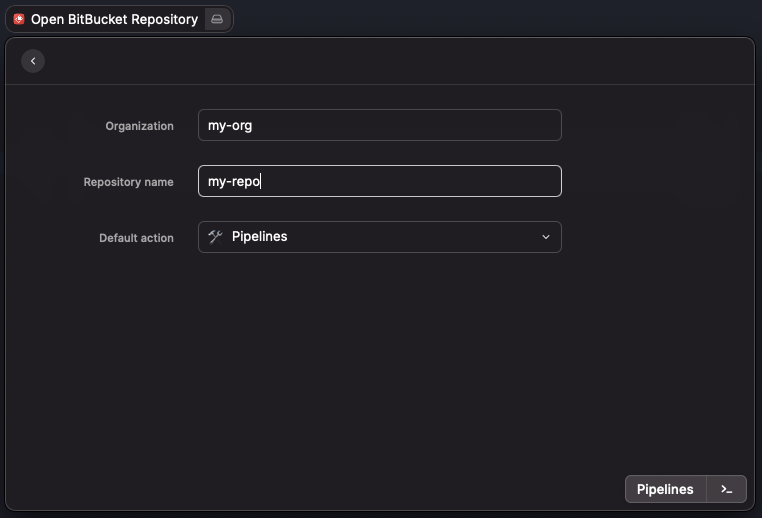
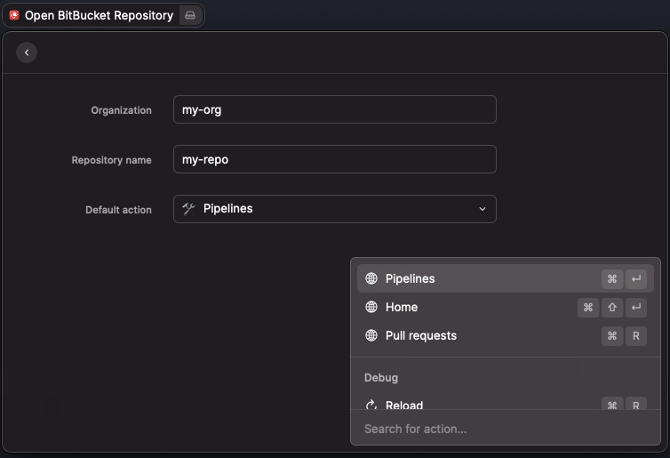

# BitBucket Opener

Working with lots of repos i BitBucket? Tired of switching to a browser, finding a bookmark, load the page, click on Pipelines or Pull requests a million times a day? Say no more!

This [Raycast](https://www.raycast.com/) extension lets you type in just the repo name and use shortcuts to open a browser in for example the Pull requests page.

It remembers the _Organization_ and _Default action_ between command invocations, leaving only _Repository name_ to be filled in.

Shortcuts after organization and repository has been filled in:

- `CMD+P`: Open Pipelines
- `CMD+R`: Open Pull requests
- `CMD+H`: Open Home

As usual in Raycast, `CMD+Enter` invokes the default action (lower right corner button) and `CMD+K` opens the menu to see all the actions. The _Default action_ dropdown list controls which action is the default action for that button (letting you choose what you want `CMD+Enter` to do by default).

# Installation

This extension is not in the Raycast extension store yet. To try it out you'll have to build it and import it locally:

- `git clone https://github.com/eaardal/raycast-bitbucket-opener.git`
- `cd raycast-bitbucket-opener`
- `npm run build`

Open Raycast (`CMD+Space`)

- `Import Extension` -> Select the `raycast-bitbucket-opener` directory

That should do it. Use the `Open BitBucket Repository` command to invoke the extension.
